<h1 align="center">
  
  <br>
  iTravel
</h1>

<p align="center">
  <strong>Discover places, share your adventures, and see the world through fellow travelers' eyes</strong>
</p>

<p align="center">
  <em>Von Travelern für Traveler</em>
</p>

<p align="center">
  <a href="https://github.com/HlexNC/iTravel">
    
  </a>
  <a href="https://developer.android.com/">
    
  </a>
  <a href="https://developers.google.com/maps">
    
  </a>
  <a href="https://m3.material.io/">
    
  </a>
</p>

---

## What is iTravel?

iTravel is a travel companion app for Android. Browse **60 hand-picked destinations** across 30+ countries on an interactive map, check the weather, scroll through beautiful travel photos, and leave reviews when you actually visit a place — the app uses your phone's GPS to make sure you're really there.

Whether you're planning your next trip or reminiscing about your last one, iTravel puts the world at your fingertips.

> [!NOTE]
> **This is V2** — a complete MVVM rewrite with a new UI/UX, expanded content, and modern architecture. See [Project History](#project-history) for details.

---

## How It Works

```mermaid
flowchart TD
    A["Open the App"] --> B["Sign Up or Log In"]
    B --> C["Explore"]

    C --> D["🗺️ Discover\nBrowse the map"]
    C --> E["📸 Feed\nTravel photos & weather"]
    C --> F["👤 Profile\nYour reviews"]

    D --> G["📍 Tap a Location\nDetails · Weather · Reviews"]
    G --> H["✍️ Leave a Review\nRate it · Add photos"]
    G --> I["❤️ Save It\nLike your favorites"]

    style A fill:#264653,color:#F1FAEE
    style B fill:#2A9D8F,color:#F1FAEE
    style C fill:#1E7B7E,color:#F1FAEE
    style D fill:#F4A261,color:#264653
    style E fill:#F4A261,color:#264653
    style F fill:#F4A261,color:#264653
    style G fill:#E76F51,color:#F1FAEE
    style H fill:#E76F51,color:#F1FAEE
    style I fill:#E76F51,color:#F1FAEE
```



---

## Features

### 🗺️ Discover
Browse all 60 destinations as pins on a **Google Maps** view. Filter by **Restaurants**, **Hotels**, **Attractions**, or **Nature** to find what interests you. Each category has its own Material Design icon for quick recognition.

### 📸 Travel Feed
A scrollable feed of gorgeous travel photos from **Unsplash** paired with **live weather data** — great for daydreaming about your next trip. Pull down to refresh for new content.

### ✍️ Reviews & Ratings
Read what other travelers think, or write your own. Add a star rating (1–5), text (minimum 50 characters), and up to 5 photos. The app checks your GPS to confirm you're within **100 meters** of the location — no fake reviews!

### ❤️ Like & Save
Tap the heart to save your favorite destinations. Your likes are synced to your profile.

### 📤 Share
Share any destination with friends via your phone's share sheet.

### 👤 Your Profile
All your reviews and stats in one place. Your account is protected with encrypted storage and hashed passwords.

---

## Design

iTravel follows **Material Design 3** with a teal-and-orange palette inspired by ocean and sunset:

| | Color | Used For |
|---|-------|----------|
| 🟩 | **Teal** `#1E7B7E` | Buttons, headers, main accents |
| 🟩 | **Seafoam** `#2A9D8F` | Highlights, secondary touches |
| 🟧 | **Orange** `#F4A261` | Warm accents, category labels |
| 🟥 | **Coral** `#E76F51` | Action buttons, FABs, important alerts |
| ⬛ | **Dark Slate** `#264653` | Text, dark backgrounds |
| ⬜ | **Off White** `#F1FAEE` | Page backgrounds, cards |

The UI features smooth **slide and fade transitions** between screens, **fall-down animations** for list items, and a **collapsing toolbar** with hero images on location detail pages.

---

## Getting Started

You'll need an **Android phone** running version 8.0 or newer (most phones from 2017+).

1. Download [Android Studio](https://developer.android.com/studio)
2. Clone the project:
   ```
   git clone --recurse-submodules https://github.com/HlexNC/iTravel.git
   ```
3. Open it in Android Studio and hit the green **Run** button
4. That's it — the app launches on your phone or emulator

> [!IMPORTANT]
> The map, travel photos, and weather features need free API keys to work. Without them the app still runs, but those sections will show placeholder content. See [docs/API_SETUP.md](docs/API_SETUP.md) for setup details.

---

## Project History

| Version | What Changed |
|---------|-------------|
| **V0** | Original prototype — partially built by @Engineer1080. Kept in `legacy/` for reference. |
| **V1** | First rewrite from scratch. New design, new features, basic architecture. |
| **V2** | MVVM + Repository rewrite. 60 locations (up from 20), full UI/UX overhaul, Material Design 3, 27 vector icons, animations, GPS-validated reviews, like system, share functionality. **You are here.** |

---

## Documentation

Detailed documentation lives in the [`docs/`](docs/) folder:

| Document | Description |
|----------|-------------|
| [ARCHITECTURE.md](docs/ARCHITECTURE.md) | MVVM + Repository pattern, package structure, data flow |
| [API_SETUP.md](docs/API_SETUP.md) | How to get and configure API keys |
| [DATABASE.md](docs/DATABASE.md) | Room schema, entities, DAOs, migrations |
| [UI_COMPONENTS.md](docs/UI_COMPONENTS.md) | Activities, fragments, animations, icons |
| [FEATURES.md](docs/FEATURES.md) | Detailed feature descriptions and implementation notes |

---

## Academic Project

> [!NOTE]
> Built as part of the **Media Technology** major at the **Deggendorf Institute of Technology (DIT)**.
<!-- PS: Not my major, did it as a personal favor for a friend. I just wanted to build a cool travel app and learn Android development along the way. -->

---

## License

Licensed under the **GNU General Public License v3.0** — see [LICENSE](LICENSE) for details.

---

<p align="center">
  <strong>Von Travelern für Traveler</strong><br>
  <a href="https://github.com/HlexNC/iTravel">GitHub</a> · <a href="docs/">Docs</a> · <a href="https://github.com/HlexNC/iTravel/issues">Report a Bug</a>
</p>
