<h1 align="center">
  
  <br>
  iTravel
</h1>

<p align="center">
  <strong>Discover places, share your adventures, and see the world through fellow travelers' eyes</strong>
</p>

<p align="center">
  <em>Von Travelern für Traveler</em>
</p>

<p align="center">
  <a href="https://github.com/HlexNC/iTravel">
    
  </a>
  <a href="https://developer.android.com/">
    
  </a>
  <a href="https://developers.google.com/maps">
    
  </a>
  <a href="https://m3.material.io/">
    
  </a>
</p>

---

## What is iTravel?

iTravel is a travel companion app for Android. Browse 20 hand-picked destinations on an interactive map, check the weather, scroll through beautiful travel photos, and leave reviews when you actually visit a place — the app uses your phone's GPS to make sure you're really there.

Whether you're planning your next trip or reminiscing about your last one, iTravel puts the world at your fingertips.

> [!NOTE]
> **This is V1** — a complete rewrite of the original prototype (V0), which was partially built by a @Engineer1080 and his AI companion and is kept in the `legacy/` folder for reference.

---

## How It Works

```mermaid
flowchart LR
    A["Open the App"] --> B["Sign Up or Log In"]
    B --> C["Explore"]

    C --> D["🗺️ Discover\nBrowse the map"]
    C --> E["📸 Feed\nTravel photos & weather"]
    C --> F["👤 Profile\nYour reviews"]

    D --> G["📍 Tap a Location\nDetails · Weather · Reviews"]
    G --> H["✍️ Leave a Review\nRate it · Add photos"]

    style A fill:#264653,color:#F1FAEE
    style B fill:#2A9D8F,color:#F1FAEE
    style C fill:#1E7B7E,color:#F1FAEE
    style D fill:#F4A261,color:#264653
    style E fill:#F4A261,color:#264653
    style F fill:#F4A261,color:#264653
    style G fill:#E76F51,color:#F1FAEE
    style H fill:#E76F51,color:#F1FAEE
```



---

## Features

### 🗺️ Discover
Browse all 20 destinations as pins on a **Google Maps** view. Filter by **Restaurants**, **Hotels**, **Attractions**, or **Nature** to find what interests you.

### 📸 Travel Feed
A scrollable feed of gorgeous travel photos and live weather — great for daydreaming about your next trip.

### ✍️ Reviews & Ratings
Read what other travelers think, or write your own. Add a star rating, text, and photos. The app checks your GPS to confirm you're actually at the location — no fake reviews!

### 🔍 Search
Find destinations by name, category, or country.

### 👤 Your Profile
All your reviews in one place. Your account is protected with encrypted storage.

---

## Design

iTravel's look is inspired by ocean and sunset — a **teal and orange** palette that feels like vacation:

| | Color | Used For |
|---|-------|----------|
| 🟩 | **Teal** `#1E7B7E` | Buttons, headers, main accents |
| 🟩 | **Seafoam** `#2A9D8F` | Highlights, secondary touches |
| 🟧 | **Orange** `#F4A261` | Warm accents, category labels |
| 🟥 | **Coral** `#E76F51` | Action buttons, important alerts |
| ⬛ | **Dark Slate** `#264653` | Text, dark backgrounds |
| ⬜ | **Off White** `#F1FAEE` | Page backgrounds, cards |

---

## Getting Started

You'll need an **Android phone** running version 8.0 or newer (most phones from 2017+).

1. Download [Android Studio](https://developer.android.com/studio)
2. Clone the project:
   ```
   git clone --recurse-submodules https://github.com/HlexNC/iTravel.git
   ```
3. Open it in Android Studio and hit the green **Run** button
4. That's it — the app launches on your phone or emulator

> [!IMPORTANT]
> The map, travel photos, and weather features need free API keys to work. Without them the app still runs, but those sections will show placeholder content. See the [wiki](https://github.com/HlexNC/iTravel/wiki/API-Integration) for setup details.

---

## Project History

| Version | What Changed |
|---------|-------------|
| **V0** | Original prototype — partially built by a different developer. Kept in `legacy/` for reference. |
| **V1** | Complete rewrite from scratch. New design, new features, modern architecture. **You are here.** |

---

## Learn More

The [project wiki](https://github.com/HlexNC/iTravel/wiki) has everything else — architecture details, API setup guides, and contributor instructions.

---

## Academic Project

> [!NOTE]
> Built as part of the **Software Engineering** course at the **Deggendorf Institute of Technology (DIT)**.

---

## License

Licensed under the **GNU General Public License v3.0** — see [LICENSE](LICENSE) for details.

---

<p align="center">
  <strong>Von Travelern für Traveler</strong><br>
  <a href="https://github.com/HlexNC/iTravel">GitHub</a> · <a href="https://github.com/HlexNC/iTravel/wiki">Wiki</a> · <a href="https://github.com/HlexNC/iTravel/issues">Report a Bug</a>
</p>
